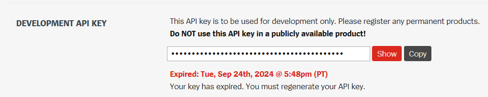

getdatalol é um script python para capturar dados da API da Riot Games.

Para executá-lo voce precisa se cadastrar no Portal de Desenvolvedor:

https://developer.riotgames.com/docs/portal

No seu Dashboard voce terá acesso a uma API KEY, que dura um dia:

O projeto é divido em:
Classe: getdatalol
Função: main

A função main precisa receber, API_KEY, o path aonde ficarão os parquets de saída, e o método, que define o que será extraído.
Caso a API_KEY informada sejá valida, a extração ja implantada tem 3 etapas:

challenger_daily - Extrai o top200 BR do dia, e salva na tabela tb_challenger_daily.

python 3.12.7